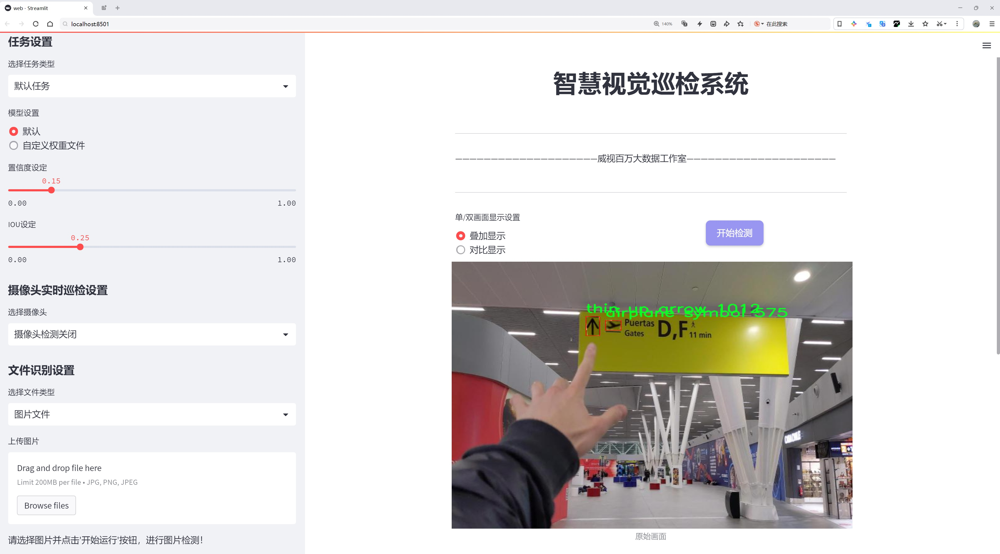
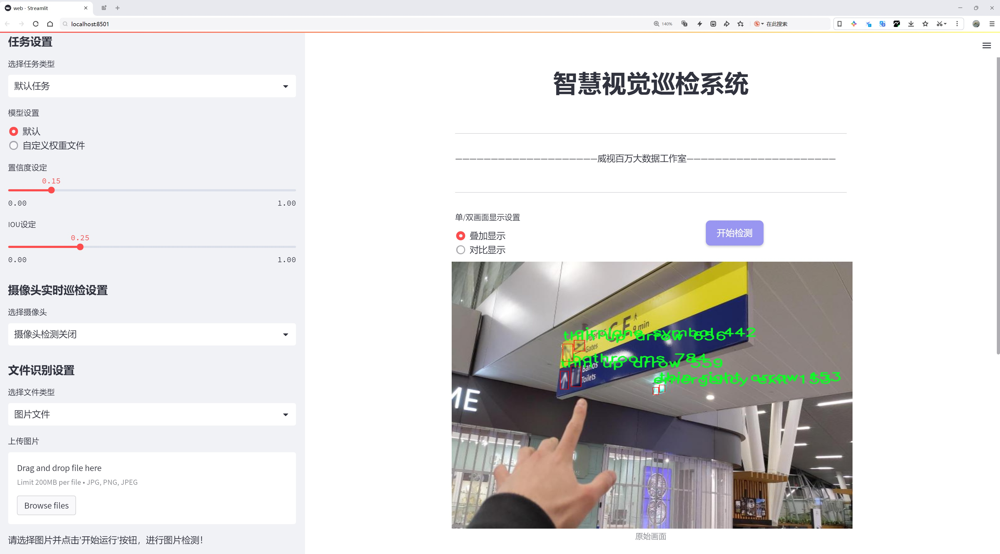
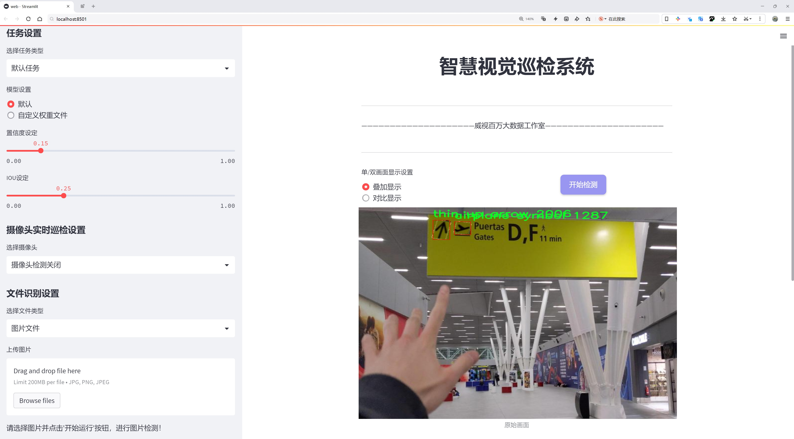
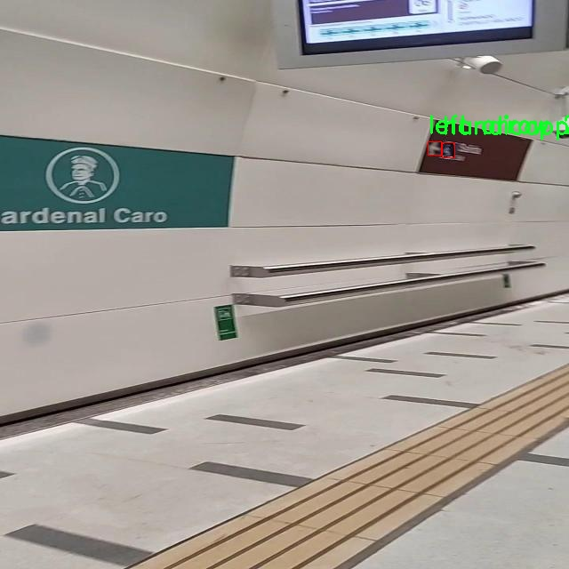
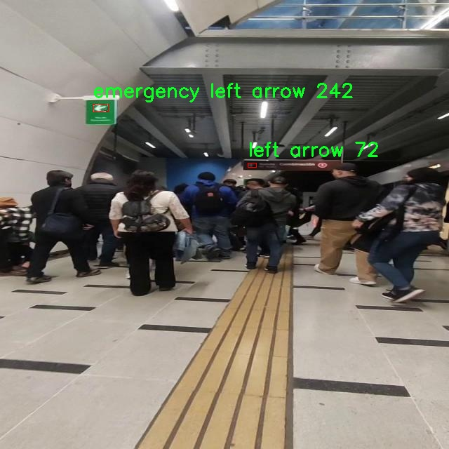
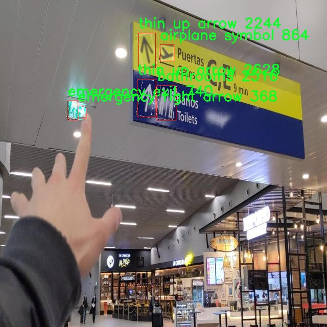
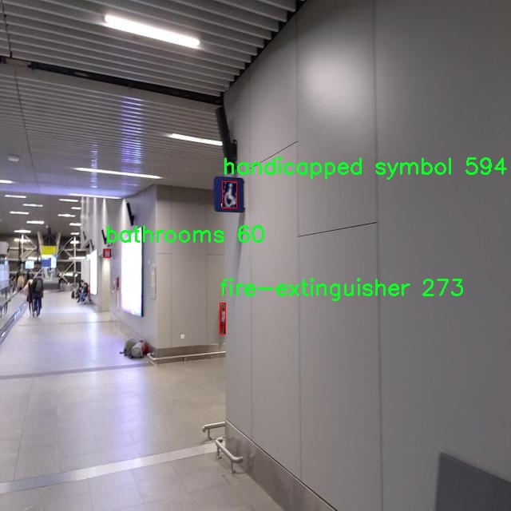
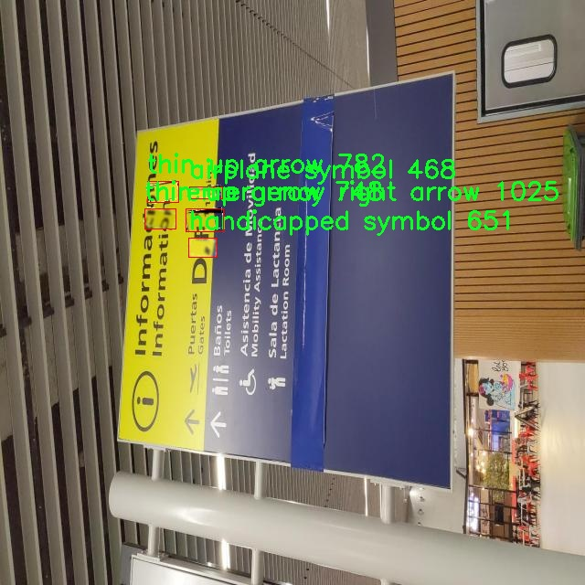

# 安全紧急逃生标识牌检测系统源码分享
 # [一条龙教学YOLOV8标注好的数据集一键训练_70+全套改进创新点发刊_Web前端展示]

### 1.研究背景与意义

项目参考[AAAI Association for the Advancement of Artificial Intelligence](https://gitee.com/qunmasj/projects)

项目来源[AACV Association for the Advancement of Computer Vision](https://kdocs.cn/l/cszuIiCKVNis)

研究背景与意义

在现代社会中，安全问题日益受到重视，尤其是在公共场所和高人流量的区域，紧急逃生标识牌的有效性直接关系到人们的生命安全。紧急逃生标识牌不仅提供了重要的逃生信息，还在危机情况下引导人们快速、安全地离开危险区域。因此，开发一种高效、准确的检测系统以识别和解析这些标识牌显得尤为重要。随着计算机视觉技术的快速发展，基于深度学习的目标检测算法已成为图像识别领域的主流方法，其中YOLO（You Only Look Once）系列算法因其高效性和实时性被广泛应用于各类目标检测任务。

YOLOv8作为YOLO系列的最新版本，进一步提升了目标检测的精度和速度。然而，针对特定场景下的标识牌检测，尤其是安全紧急逃生标识牌的检测，仍然存在一定的挑战。标识牌的种类繁多、形状各异，且在不同环境下的光照、角度和遮挡情况都可能影响检测效果。因此，基于改进YOLOv8的安全紧急逃生标识牌检测系统的研究具有重要的理论价值和实际意义。

本研究将利用BVI Signage 2数据集，该数据集包含2800张图像，涵盖22种不同类别的标识牌，如“紧急出口”、“灭火器”、“电力危险”等。这些标识牌在公共场所的安全管理中扮演着至关重要的角色。通过对这些标识牌的准确检测和分类，可以有效提高人们在紧急情况下的逃生效率，降低因信息不明确而导致的安全隐患。此外，数据集中丰富的类别信息为模型的训练提供了良好的基础，使得检测系统能够在多样化的场景中保持高效的识别能力。

在技术层面，本研究将针对YOLOv8进行改进，结合迁移学习和数据增强等技术，提升模型在复杂环境下的鲁棒性和准确性。通过对模型进行优化，可以有效降低误检和漏检的概率，确保在紧急情况下能够快速、准确地识别出各类安全标识牌。这不仅有助于提升公共安全管理的智能化水平，也为未来的安全监控系统提供了新的思路和方法。

综上所述，基于改进YOLOv8的安全紧急逃生标识牌检测系统的研究，不仅具有重要的学术价值，也为实际应用提供了有力的支持。通过提高标识牌的检测精度和效率，可以有效增强人们在危机情况下的安全感，推动公共安全管理的智能化进程，具有广泛的社会意义和应用前景。

### 2.图片演示







##### 注意：由于此博客编辑较早，上面“2.图片演示”和“3.视频演示”展示的系统图片或者视频可能为老版本，新版本在老版本的基础上升级如下：（实际效果以升级的新版本为准）

  （1）适配了YOLOV8的“目标检测”模型和“实例分割”模型，通过加载相应的权重（.pt）文件即可自适应加载模型。

  （2）支持“图片识别”、“视频识别”、“摄像头实时识别”三种识别模式。

  （3）支持“图片识别”、“视频识别”、“摄像头实时识别”三种识别结果保存导出，解决手动导出（容易卡顿出现爆内存）存在的问题，识别完自动保存结果并导出到tempDir中。

  （4）支持Web前端系统中的标题、背景图等自定义修改，后面提供修改教程。

  另外本项目提供训练的数据集和训练教程,暂不提供权重文件（best.pt）,需要您按照教程进行训练后实现图片演示和Web前端界面演示的效果。

### 3.视频演示

[3.1 视频演示](https://www.bilibili.com/video/BV19627YaEpK/)

### 4.数据集信息展示

##### 4.1 本项目数据集详细数据（类别数＆类别名）

nc: 21
names: ['airplane symbol', 'baggage claim', 'bathrooms', 'danger-electricity', 'down arrow', 'emergency down arrow', 'emergency exit', 'emergency left arrow', 'emergency right arrow', 'emergency up arrow', 'extinguisher symbol', 'fire-extinguisher', 'handicapped symbol', 'left arrow', 'no trespassing', 'restaurants', 'right arrow', 'thin left arrow', 'thin right arrow', 'thin up arrow', 'up arrow']


##### 4.2 本项目数据集信息介绍

数据集信息展示

在本研究中，我们采用了名为“BVI Signage 2”的数据集，以训练和改进YOLOv8模型，旨在提升安全紧急逃生标识牌的检测系统。该数据集专门设计用于涵盖各种紧急情况下可能遇到的标识符，确保在危机时刻能够迅速、准确地引导人们找到安全出口或必要的安全设施。数据集的丰富性和多样性为我们的模型提供了坚实的基础，使其能够在不同环境中表现出色。

“BVI Signage 2”数据集包含21个类别的标识符，这些类别涵盖了从基本的方向指示到特定的安全设施标识，确保了对紧急情况的全面响应。具体类别包括“airplane symbol”（飞机符号）、“baggage claim”（行李领取）、“bathrooms”（洗手间）、“danger-electricity”（电力危险）、“down arrow”（向下箭头）、“emergency down arrow”（紧急向下箭头）、“emergency exit”（紧急出口）、“emergency left arrow”（紧急左箭头）、“emergency right arrow”（紧急右箭头）、“emergency up arrow”（紧急向上箭头）、“extinguisher symbol”（灭火器符号）、“fire-extinguisher”（灭火器）、“handicapped symbol”（残疾人标识）、“left arrow”（左箭头）、“no trespassing”（禁止入内）、“restaurants”（餐厅）、“right arrow”（右箭头）、“thin left arrow”（细左箭头）、“thin right arrow”（细右箭头）、“thin up arrow”（细向上箭头）和“up arrow”（向上箭头）。这些类别不仅反映了日常生活中常见的标识符，还涵盖了在紧急情况下人们需要迅速识别的关键指示。

数据集的构建过程中，特别注重标识符的清晰度和可识别性，以确保在各种环境光照和视觉条件下，模型能够准确识别和分类这些标识牌。通过使用高质量的图像和多样化的场景设置，数据集提供了丰富的训练样本，使得YOLOv8模型能够学习到更为复杂的特征和模式，从而提高其在实际应用中的鲁棒性和准确性。

此外，数据集的多样性也体现在标识符的不同设计和风格上，这些设计可能因地区、文化或行业而异。因此，模型的训练不仅需要识别标识符的形状和颜色，还需要理解其在特定上下文中的意义。这种复杂性要求我们在训练过程中采用先进的算法和技术，以确保模型能够适应不同的标识符风格，并在实际应用中保持高效的识别能力。

总之，“BVI Signage 2”数据集为我们改进YOLOv8的安全紧急逃生标识牌检测系统提供了丰富的资源和坚实的基础。通过充分利用这一数据集，我们期望能够提升模型在紧急情况下的表现，确保人们在危机时刻能够快速找到安全出口和必要的安全设施，从而有效减少潜在的伤害和损失。











### 5.全套项目环境部署视频教程（零基础手把手教学）

[5.1 环境部署教程链接（零基础手把手教学）](https://www.ixigua.com/7404473917358506534?logTag=c807d0cbc21c0ef59de5)


[5.2 安装Python虚拟环境创建和依赖库安装视频教程链接（零基础手把手教学）](https://www.ixigua.com/7404474678003106304?logTag=1f1041108cd1f708b01a)

### 6.手把手YOLOV8训练视频教程（零基础小白有手就能学会）

[6.1 手把手YOLOV8训练视频教程（零基础小白有手就能学会）](https://www.ixigua.com/7404477157818401292?logTag=d31a2dfd1983c9668658)


按照上面的训练视频教程链接加载项目提供的数据集，运行train.py即可开始训练



     Epoch   gpu_mem       box       obj       cls    labels  img_size
     1/200     20.8G   0.01576   0.01955  0.007536        22      1280: 100%|██████████| 849/849 [14:42<00:00,  1.04s/it]
               Class     Images     Labels          P          R     mAP@.5 mAP@.5:.95: 100%|██████████| 213/213 [01:14<00:00,  2.87it/s]
                 all       3395      17314      0.994      0.957      0.0957      0.0843

     Epoch   gpu_mem       box       obj       cls    labels  img_size
     2/200     20.8G   0.01578   0.01923  0.007006        22      1280: 100%|██████████| 849/849 [14:44<00:00,  1.04s/it]
               Class     Images     Labels          P          R     mAP@.5 mAP@.5:.95: 100%|██████████| 213/213 [01:12<00:00,  2.95it/s]
                 all       3395      17314      0.996      0.956      0.0957      0.0845

     Epoch   gpu_mem       box       obj       cls    labels  img_size
     3/200     20.8G   0.01561    0.0191  0.006895        27      1280: 100%|██████████| 849/849 [10:56<00:00,  1.29it/s]
               Class     Images     Labels          P          R     mAP@.5 mAP@.5:.95: 100%|███████   | 187/213 [00:52<00:00,  4.04it/s]
                 all       3395      17314      0.996      0.957      0.0957      0.0845


### 7.70+种全套YOLOV8创新点代码加载调参视频教程（一键加载写好的改进模型的配置文件）

[7.1 70+种全套YOLOV8创新点代码加载调参视频教程（一键加载写好的改进模型的配置文件）](https://www.ixigua.com/7404478314661806627?logTag=29066f8288e3f4eea3a4)

### 8.70+种全套YOLOV8创新点原理讲解（非科班也可以轻松写刊发刊，V10版本正在科研待更新）

#### 由于篇幅限制，每个创新点的具体原理讲解就不一一展开，具体见下列网址中的创新点对应子项目的技术原理博客网址【Blog】：


[8.1 70+种全套YOLOV8创新点原理讲解链接](https://gitee.com/qunmasj/good)

#### 部分改进原理讲解(完整的改进原理见上图和技术博客链接)
### YOLOv8简介
在各种目标检测算法中，YOLO系列因其速度和准确度间的优异平衡脱颖而出，能够准确、快速的识别目标，便于部署到各种移动设备中，已经广泛应用于各种领域的目标检测、跟踪和分割。目前最新版本 YOLOv8由原v5的开发团队Ultralytics于2023年1月提出，按规格大小可划分为n、s、m、1和x5个版本，是目前最先进的目标检测算法，有着优异的性能，很适合用于无人机航拍图像目标检测。其网络结构如图所示。

YOLOv8模型包括Input、Backbone、Neck 和Head4部分。其中 Input选用了Mosaic数据增强方法，并且对于不同大小的模型，有部分超参数会进行修改，典型的如大模型会开启 MixUp 和CopyPaste数据增强，能够丰富数据集，提升模型的泛化能力和鲁棒性。Backbone主要用于提取图片中的信息，提供给Neck和Head使用，由多个Conv、C2f模块和尾部的SPPF组成。Conv模块由单个Conv2d、
BatchNorm2d和激活函数构成,用丁是双行在万E5特征图;YOLOv8参考了C3模块的残左绒以心YOLOv7[16l的ELAN思想，设计出了C2f 结构，可以在保证轻量化的同时获得更加丰富的梯度流信息，并根据模型尺度来调整通道数，大幅提升了模型性能;SPPF是空间金字塔池化，能够融合不同尺度的特征。Neck部分主要起特征融合的作用，充分利用了骨干网络提取的特征，采用FPN[17]+PAN[18〕结构，
能够增强多个尺度上的语义表达和定位能力。Head输出端根据前两部分处理得到的特征来获取检测目标的类别和位置信息，做出识别,换以小旦公来和定解耦头结构,将分类和检测头分:9w‘无锅框的位关注侧重点不同的问题，同时也采用了无锚框的目标检测（Anchor-Free)，能够提升检测速度。Loss计算方面采用了正负样本动态分配策略，使用 VFLLoss 作为分类损失，使用DFLLoss+CIOU Loss作为回归损失。

### AutoFocus: Efficient Multi-Scale Conv简介

参考该博客提出了AutoFocus，一种高效的多尺度目标检测算法。相较于以前对整个图像金字塔进行处理，该方法以一种由表及里的姿态，仅处理哪些整体上看来很有可能存在小物体的区域。这个可以通过预测一张类别未知的分割图FocusPixels来得到。为了高效利用FocusPixels，另外一个算法用于产生包含FocusPixels的FocusChips，这样可以减少计算量并处理更更精细的尺度。在不同尺度上FocusChips所得到的检测结果综合时，会出现问题，我们也提供了解决问题的方案。AutoFocus在COCO上的结果有49.7%mAP（50%重叠下68.3%），与多尺度baseline相仿但是快了2.5倍。金字塔中处理的像素数量减少了5倍mAP只下降1%，在与RetinaNet采用相同的ResNet-101结构且速度相同时，高了10%mAP。

人类寻找物体是一个动态的过程，且寻找时间与场景的复杂度是直接相关的。当我们的眼神在不同的点之间漂移时，其他的区域会被我们有意忽视。然而，现在的检测算法是一种静态的推理过程且图像金字塔中的每个像素都受到了一样的对待，这使得过程变得没有效率。现在许多的应用都不强调实时性，而计算上的节省其实可以产生很大收益。

在COCO数据集中，虽然40%的物体都是小物体，但是它们一共只占了全图的0.3%。如果金字塔是3倍关系，则在高分辨率层要进行9倍的运算。XXX 。那么有没有办法在低分辨率下找出可能含有这些物体的区域呢？

以人眼方案类比，我们可以从低分辨率图像开始，找出有可能存在物体的区域再“聚集”到高分辨率。我们的AutoFocus会在一层中计算小物体的分割图FocusPixels，而在每一个FocusPixels上会用一个算法产生下一层所需要关注的chips。在COCO的最大分辨率层上我们可以只处理**20%的像素而性能不下降，如果只处理5%**也只下降1%而已。


图像金字塔与卷积神经网络对CV十分重要。然而卷积神经网络无法做到对尺度不敏感，所以为了不同大小的物体需要依赖图像金字塔。虽然训练已经有了高效的方法，但是其推断时间依然远离实际使用标准。

目标检测加速有很长历史了。常用的有特征近似以减少尺度、级联、特征金字塔，且最后一个最近很多人研究。

AutoFocus为速度与精度之间提供了一个平滑的折衷，指出可以在低分辨率下看出小物体的所在，从而节约计算。FocusPixels的计算较为容易。

先简单介绍一下SNIP，是一种多尺度的训练、推断算法。主要思想是训练针对某个特定scale的检测器而不是scale-invariant检测器。这样训练样本就局限于在某个尺度范围内，以适于这个检测器处理。比如在高分辨率仅处理小物体而高分辨率仅处理大物体，其优势在于训练时不用考虑尺度的变化。

由于训练时物体大小是已知的，我们在图像金字塔中可以忽略大量区域而只处理物体周围的区域。SNIPER说明这样低分辨率的训练与全图训练相比并不会降低性能。同样，在推断过程中如果可以在大分辨率图像上预测可能出现小物体的chip，我们也就不用处理整张高分辨率图片。在训练时，许多物体会被裁剪、扭曲，这可以当作是一种数据扩增，然而当这个情况在推断时出现，则会产生错误，所以我们还需要一个算法来整合不同尺度上的检测结果。

#### AutoFocus框架
如SIFT、SURF等传统分类特征包含两个组件，一个detector和一个descriptor。detector只包含轻量级的操作如DoG、LoG，用于在整张图片上找到感兴趣的区域；descriptor，一般来说计算量比较大，则只需要关注那些咸兴趣的区域。这个级联结构保障了图片处理的效率。

同样，AutoFocus框架也是用于预测感兴趣的区域，并丢弃在下一尺度不可能存在物体的区域，并将裁剪和缩放后的区域传递给下一尺度。AutoFocus由三个部分组成：FocusPixels，FocusChips和focus stacking。

#### FocusPixels
FocusPixels定义在卷积网络特征图的粒度之上（如conv5），如果特征图上某个像素与小物体有重叠则标注为一个FocusPixel。（小物体：面积处于一个网络的输入范围之内）。训练过程中，FocusPixels标注为正，某些与不在面积范围内的物体有重叠的像素标注为无效，其他像素标注为负。AutoFocus的训练目标是使在FocusPixels区域产生较大的激活值。

如果同时多个物体与同一像素重叠，优先给正标注。我们的网络输入是512x512，然后a,b,c取值分别是5,64,90。对于太大或太小的物体，我们认为当前尺度上没有足够人信息进行判断，所以会标定为无效。整个网络结构如下图。训练时加两层带ReLU的卷积(3x3和1x1)以及一个二分类softmax来预测FocusPixels。


#### FocusChip生成
推断过程中，我们标注输出概率大于阈值t的像素（这个参数可以控制加速比），得到一些连通域。对于每一个域，我们做一次膨胀使其包含一些有助于识别的周围信息，膨胀后相连的部分要合并。然后，我们生成一些包含连通域的chips（不同chips可能重叠，如有重叠则合并）。有些chip可能太小缺少必要信息，并使chip的大小变化很大，为了效率我们要求保证一个最小的chip size。算法流程如下：


#### 级联推断过程
我们的过程类似于图片金字塔的推断过程但是在过程中一步步去除不关注的图片区域。我们在最低分辨率上进行检测并生成chips，然后在这些chips再进行检测和生成chips。

#### Focus Stacking
这种级联分类器的一个问题是在chip边缘本来的大物体可能生成一些被剪裁的检测目标。在下一个尺度上，由于剪裁过了，所以会检测到小的、错误的正例False Positive。之前算法中的第二步膨胀其实就是为了保证没有物体会出现在chip的边缘。这样，当我们在局部图片chip的边缘检测到物体时，就可以把这个检测结果丢弃，即使其在SNIP的范围内。

也有一些物体在图片边缘的特殊情况。如果chip和图片共享一条边的话，我们会检查检测结果的其他边是否完全在里面，如果在，则保留它，否则丢弃。

在每一尺度得到有效检测结果后，我们可以将不同尺度上的结果进行整合，将这些结果映射到原图坐标系上。最后，非极大值抑制NMS用于聚集。网络结构如之前的图片所示。


### 9.系统功能展示（检测对象为举例，实际内容以本项目数据集为准）

图9.1.系统支持检测结果表格显示

  图9.2.系统支持置信度和IOU阈值手动调节

  图9.3.系统支持自定义加载权重文件best.pt(需要你通过步骤5中训练获得)

  图9.4.系统支持摄像头实时识别

  图9.5.系统支持图片识别

  图9.6.系统支持视频识别

  图9.7.系统支持识别结果文件自动保存

  图9.8.系统支持Excel导出检测结果数据


### 10.原始YOLOV8算法原理

原始YOLOv8算法原理

YOLOv8算法是目标检测领域的一项重要进展，继承了YOLO系列的优良传统，同时在YOLOv5和YOLOv7的基础上进行了多项创新和改进。该算法的核心结构依然包括输入层、主干网络、特征融合层和解耦头，构成了一个高效且准确的目标检测框架。尽管YOLOv8的相关论文尚未正式发表，但其设计理念和实现细节已经在多个研究和应用中得到了验证。

在主干网络方面，YOLOv8采用了YOLOv5的CSPDarknet思想，并将YOLOv5中的C3模块替换为C2f模块。C2f模块的设计灵感来源于YOLOv7的ELAN结构，旨在通过增加跳层连接来丰富梯度流信息，从而缓解深层网络中的梯度消失问题。C2f模块包含多个CBS（卷积+归一化+SiLU激活函数）结构，结合了卷积操作和归一化技术，确保了在反向传播过程中梯度的稳定性和有效性。通过引入ELAN思想，C2f模块能够更好地重用浅层特征，提升了特征提取的能力，同时保持了模型的轻量化特性。

YOLOv8的特征融合层采用了PAN-FPN结构，这一结构在YOLOv5的基础上进行了优化。PAN-FPN能够有效地融合来自不同层次的特征信息，使得模型在处理多尺度目标时表现得更加出色。在特征融合过程中，YOLOv8去除了YOLOv5中上采样阶段的1×1卷积操作，直接将高层特征进行上采样并与中层特征进行拼接。这种设计使得网络能够更好地结合高层的语义信息和浅层的细节信息，从而提高目标检测的准确性。

YOLOv8的一个显著特点是采用了Anchor-Free的思想，摒弃了传统的Anchor-Based方法。这一转变使得模型在处理目标时更加灵活，能够直接预测目标的中心位置，并通过Task-Aligned的样本匹配策略来优化正负样本的分配。这种动态标签分配策略使得YOLOv8在处理复杂场景时能够更好地适应目标的多样性和不确定性。

在损失函数方面，YOLOv8引入了VFLLoss作为分类损失，结合DFLLoss和CIoULoss作为回归损失。这一组合损失函数不仅能够有效地处理样本不平衡问题，还能够提高模型对难以分类样本的关注度。VFLLoss通过不对称参数对正负样本进行加权，使得高质量的正样本在损失计算中占据更大的比重，从而推动模型的学习过程向更优的方向发展。

在网络的头部结构中，YOLOv8采用了解耦头的设计理念，分类和回归任务被分为两个独立的分支。这种解耦设计使得模型在处理分类和定位任务时能够更加专注于各自的特征提取，从而提高了检测的精度和速度。解耦头的输出特征图经过Softmax和卷积操作，最终生成边框回归和目标分类的结果。

为了增强模型的鲁棒性，YOLOv8在数据预处理阶段继续采用YOLOv5的策略，使用了多种数据增强技术，如马赛克增强、混合增强、空间扰动和颜色扰动等。这些增强手段在训练过程中帮助模型更好地适应不同的输入条件，提高了模型的泛化能力。

综上所述，YOLOv8算法通过对主干网络、特征融合层、损失函数和解耦头等多个方面的创新，构建了一个高效的目标检测框架。其设计理念不仅延续了YOLO系列的优良传统，还结合了最新的研究成果，展示了在目标检测任务中的强大性能。随着YOLOv8的不断发展和应用，预计将在多个领域产生深远的影响，推动目标检测技术的进一步进步。


### 11.项目核心源码讲解（再也不用担心看不懂代码逻辑）

#### 11.1 code\ultralytics\models\nas\val.py

以下是经过简化和注释的核心代码部分：

```python
# 导入必要的库
import torch
from ultralytics.utils import ops

class NASValidator:
    """
    Ultralytics YOLO NAS 验证器，用于目标检测。

    该类用于后处理 YOLO NAS 模型生成的原始预测结果。它执行非极大值抑制（NMS），以去除重叠和低置信度的框，
    最终生成最终的检测结果。
    """

    def __init__(self, args):
        """
        初始化 NASValidator。

        参数:
            args (Namespace): 包含后处理的各种配置，如置信度和 IoU 阈值。
        """
        self.args = args  # 保存配置参数

    def postprocess(self, preds_in):
        """对预测输出应用非极大值抑制（NMS）。"""
        # 将预测框从 xyxy 格式转换为 xywh 格式
        boxes = ops.xyxy2xywh(preds_in[0][0])
        
        # 将框和置信度合并，并调整维度
        preds = torch.cat((boxes, preds_in[0][1]), -1).permute(0, 2, 1)
        
        # 应用非极大值抑制，去除重叠的框
        return ops.non_max_suppression(
            preds,                     # 预测结果
            self.args.conf,           # 置信度阈值
            self.args.iou,            # IoU 阈值
            labels=None,              # 标签（可选）
            multi_label=False,        # 是否多标签
            agnostic=self.args.single_cls,  # 是否单类
            max_det=self.args.max_det,  # 最大检测框数量
            max_time_img=0.5,        # 每张图像的最大处理时间
        )
```

### 代码注释说明：

1. **导入库**：引入 `torch` 和 `ops` 模块，后者包含了处理预测框的工具函数。
2. **类定义**：`NASValidator` 类用于处理 YOLO NAS 模型的预测结果。
3. **初始化方法**：构造函数接收一个配置参数 `args`，用于存储后处理所需的阈值等设置。
4. **postprocess 方法**：
   - 将输入的预测框从 `xyxy` 格式（左上角和右下角坐标）转换为 `xywh` 格式（中心坐标和宽高）。
   - 合并框和置信度，并调整维度以适应后续处理。
   - 调用 `non_max_suppression` 函数，去除重叠的低置信度框，返回最终的检测结果。

这个文件 `val.py` 是 Ultralytics YOLO 模型库中的一部分，主要用于对象检测任务中的验证过程。文件中定义了一个名为 `NASValidator` 的类，该类继承自 `DetectionValidator`，并专门用于处理 YOLO NAS 模型生成的原始预测结果。

在这个类的文档字符串中，说明了它的主要功能是对 YOLO NAS 模型的预测结果进行后处理，具体包括执行非极大值抑制（Non-Maximum Suppression, NMS），以去除重叠和低置信度的边界框，从而生成最终的检测结果。类中包含了一些属性，例如 `args`，它是一个命名空间，包含了后处理所需的各种配置参数，如置信度和 IoU（Intersection over Union）阈值；还有 `lb`，这是一个可选的张量，用于多标签 NMS。

在示例代码中，展示了如何使用 `NASValidator`。首先从 `ultralytics` 导入 `NAS` 类，然后创建一个 YOLO NAS 模型的实例，接着获取该模型的验证器，并假设有原始预测结果 `raw_preds`，最后调用 `postprocess` 方法来处理这些预测结果，得到最终的预测结果。

`postprocess` 方法是该类的核心功能，它接受预测输入 `preds_in`，首先将预测框的坐标从 xyxy 格式转换为 xywh 格式。然后，将边界框和对应的置信度合并，并进行维度变换。接下来，调用 `ops.non_max_suppression` 方法，执行非极大值抑制，返回处理后的预测结果。这个方法的参数包括置信度阈值、IoU 阈值、标签、是否多标签、是否无类别限制、最大检测数量和每张图像的最大处理时间等。

需要注意的是，这个类通常不会被直接实例化，而是在 `NAS` 类内部使用。整体来看，这个文件的功能是实现 YOLO NAS 模型的后处理步骤，以提高检测结果的准确性和有效性。

#### 11.2 ui.py

以下是代码中最核心的部分，并附上详细的中文注释：

```python
import sys
import subprocess

def run_script(script_path):
    """
    使用当前 Python 环境运行指定的脚本。

    Args:
        script_path (str): 要运行的脚本路径

    Returns:
        None
    """
    # 获取当前 Python 解释器的路径
    python_path = sys.executable

    # 构建运行命令，使用 streamlit 运行指定的脚本
    command = f'"{python_path}" -m streamlit run "{script_path}"'

    # 执行命令，并等待其完成
    result = subprocess.run(command, shell=True)
    
    # 检查命令执行的返回码，如果不为0，表示出错
    if result.returncode != 0:
        print("脚本运行出错。")

# 主程序入口
if __name__ == "__main__":
    # 指定要运行的脚本路径
    script_path = "web.py"  # 这里可以直接指定脚本名，假设它在当前目录下

    # 调用函数运行脚本
    run_script(script_path)
```

### 代码注释说明：
1. **导入模块**：
   - `sys`：用于获取当前 Python 解释器的路径。
   - `subprocess`：用于执行外部命令。

2. **定义 `run_script` 函数**：
   - 接受一个参数 `script_path`，表示要运行的 Python 脚本的路径。
   - 使用 `sys.executable` 获取当前 Python 解释器的路径，以确保使用正确的 Python 环境来运行脚本。
   - 构建命令字符串，使用 `streamlit` 模块运行指定的脚本。
   - 使用 `subprocess.run` 执行命令，并等待其完成。
   - 检查命令的返回码，如果返回码不为0，表示脚本运行出错，打印错误信息。

3. **主程序入口**：
   - 使用 `if __name__ == "__main__":` 确保只有在直接运行该脚本时才会执行以下代码。
   - 指定要运行的脚本路径（这里假设脚本在当前目录下）。
   - 调用 `run_script` 函数来执行指定的脚本。

这个程序文件的主要功能是通过当前的 Python 环境来运行一个指定的脚本，具体来说是一个名为 `web.py` 的脚本。程序首先导入了必要的模块，包括 `sys`、`os` 和 `subprocess`，以及一个自定义的 `abs_path` 函数，用于获取脚本的绝对路径。

在 `run_script` 函数中，首先获取当前 Python 解释器的路径，这通过 `sys.executable` 实现。接着，构建一个命令字符串，这个命令会使用 `streamlit` 来运行指定的脚本。`streamlit` 是一个用于构建数据应用的库，命令的格式是 `python -m streamlit run "script_path"`。

然后，使用 `subprocess.run` 方法来执行这个命令。`shell=True` 参数允许在 shell 中执行命令。如果脚本运行过程中出现错误，返回码将不为零，此时程序会打印出“脚本运行出错”的提示。

在文件的最后部分，使用 `if __name__ == "__main__":` 语句来确保只有在直接运行该文件时才会执行后面的代码。在这里，首先调用 `abs_path` 函数获取 `web.py` 的绝对路径，然后调用 `run_script` 函数来运行这个脚本。

总的来说，这个程序文件的目的是为了方便地通过当前 Python 环境来运行一个 Streamlit 应用脚本，并处理可能出现的错误。

#### 11.3 code\ultralytics\models\rtdetr\predict.py

以下是经过简化和注释的核心代码部分：

```python
import torch
from ultralytics.data.augment import LetterBox
from ultralytics.engine.predictor import BasePredictor
from ultralytics.engine.results import Results
from ultralytics.utils import ops

class RTDETRPredictor(BasePredictor):
    """
    RT-DETR预测器，继承自BasePredictor类，用于使用百度的RT-DETR模型进行预测。
    该类利用视觉变换器的强大功能，提供实时目标检测，同时保持高精度。
    """

    def postprocess(self, preds, img, orig_imgs):
        """
        对模型的原始预测结果进行后处理，生成边界框和置信度分数。

        参数:
            preds (torch.Tensor): 模型的原始预测结果。
            img (torch.Tensor): 处理后的输入图像。
            orig_imgs (list or torch.Tensor): 原始未处理的图像。

        返回:
            (list[Results]): 包含后处理后的边界框、置信度分数和类别标签的Results对象列表。
        """
        # 获取预测结果的维度
        nd = preds[0].shape[-1]
        # 分割边界框和分数
        bboxes, scores = preds[0].split((4, nd - 4), dim=-1)

        # 如果输入图像不是列表，则转换为numpy数组
        if not isinstance(orig_imgs, list):
            orig_imgs = ops.convert_torch2numpy_batch(orig_imgs)

        results = []
        for i, bbox in enumerate(bboxes):  # 遍历每个边界框
            bbox = ops.xywh2xyxy(bbox)  # 将边界框格式从xywh转换为xyxy
            score, cls = scores[i].max(-1, keepdim=True)  # 获取最大分数和对应的类别
            idx = score.squeeze(-1) > self.args.conf  # 根据置信度过滤

            # 如果指定了类别，则进一步过滤
            if self.args.classes is not None:
                idx = (cls == torch.tensor(self.args.classes, device=cls.device)).any(1) & idx
            
            # 过滤后的预测结果
            pred = torch.cat([bbox, score, cls], dim=-1)[idx]
            orig_img = orig_imgs[i]  # 获取原始图像
            oh, ow = orig_img.shape[:2]  # 获取原始图像的高度和宽度
            
            # 将预测框的坐标从相对坐标转换为绝对坐标
            pred[..., [0, 2]] *= ow
            pred[..., [1, 3]] *= oh
            
            # 创建Results对象并添加到结果列表
            img_path = self.batch[0][i]
            results.append(Results(orig_img, path=img_path, names=self.model.names, boxes=pred))
        
        return results

    def pre_transform(self, im):
        """
        在将输入图像输入模型进行推理之前，对其进行预处理。
        输入图像被调整为方形比例并填充。

        参数:
            im (list[np.ndarray] | torch.Tensor): 输入图像，形状为(N,3,h,w)的张量或[(h,w,3) x N]的列表。

        返回:
            (list): 预处理后的图像列表，准备进行模型推理。
        """
        letterbox = LetterBox(self.imgsz, auto=False, scaleFill=True)  # 创建LetterBox对象
        return [letterbox(image=x) for x in im]  # 对每个图像进行预处理
```

### 代码说明：
1. **RTDETRPredictor类**：这是一个目标检测预测器，继承自基础预测器类，专门用于RT-DETR模型。
2. **postprocess方法**：该方法负责处理模型的原始预测结果，提取边界框和置信度分数，并根据设定的置信度和类别进行过滤，最终返回一个包含检测结果的列表。
3. **pre_transform方法**：该方法在模型推理之前对输入图像进行预处理，确保图像为方形并填充，以适应模型的输入要求。

这个程序文件 `predict.py` 是 Ultralytics YOLO 框架的一部分，主要用于实现 RT-DETR（实时检测变换器）模型的预测功能。该文件导入了必要的库和模块，并定义了一个名为 `RTDETRPredictor` 的类，该类继承自 `BasePredictor`，用于执行目标检测任务。

在类的文档字符串中，简要介绍了 RT-DETR 模型的特点，包括其利用视觉变换器的能力来实现实时目标检测，同时保持高精度。该类支持高效的混合编码和 IoU（交并比）感知查询选择等关键特性。文档中还提供了一个示例，展示了如何使用该预测器进行推理。

`RTDETRPredictor` 类有两个主要的方法：`postprocess` 和 `pre_transform`。

`postprocess` 方法用于对模型的原始预测结果进行后处理，以生成边界框和置信度分数。该方法首先从预测结果中分离出边界框和分数，然后根据置信度和指定的类别进行过滤。它还会将边界框的坐标从相对坐标转换为绝对坐标，并将结果封装成 `Results` 对象，最终返回一个包含所有检测结果的列表。

`pre_transform` 方法则用于在将输入图像送入模型进行推理之前，对其进行预处理。具体来说，它会将输入图像进行信箱填充，以确保图像为正方形并且填充比例正确。该方法接受的输入可以是一个图像张量或图像列表，并返回经过预处理的图像列表，准备好进行模型推理。

总体而言，这个文件实现了 RT-DETR 模型的预测功能，通过对输入图像的预处理和对模型输出的后处理，使得目标检测过程更加高效和准确。

#### 11.4 code\ultralytics\models\yolo\detect\val.py

以下是经过简化并添加详细中文注释的核心代码部分：

```python
import os
import torch
from ultralytics.engine.validator import BaseValidator
from ultralytics.utils import LOGGER, ops
from ultralytics.utils.metrics import DetMetrics, box_iou

class DetectionValidator(BaseValidator):
    """
    继承自BaseValidator类，用于基于检测模型的验证。
    """

    def __init__(self, dataloader=None, save_dir=None, pbar=None, args=None, _callbacks=None):
        """初始化检测模型所需的变量和设置。"""
        super().__init__(dataloader, save_dir, pbar, args, _callbacks)
        self.metrics = DetMetrics(save_dir=self.save_dir)  # 初始化检测指标
        self.iouv = torch.linspace(0.5, 0.95, 10)  # 定义IoU向量用于计算mAP

    def preprocess(self, batch):
        """对YOLO训练的图像批次进行预处理。"""
        batch["img"] = batch["img"].to(self.device, non_blocking=True)  # 将图像转移到设备上
        batch["img"] = batch["img"].float() / 255  # 将图像归一化到[0, 1]
        for k in ["batch_idx", "cls", "bboxes"]:
            batch[k] = batch[k].to(self.device)  # 将其他数据转移到设备上
        return batch

    def postprocess(self, preds):
        """对预测输出应用非极大值抑制（NMS）。"""
        return ops.non_max_suppression(
            preds,
            self.args.conf,
            self.args.iou,
            multi_label=True,
            max_det=self.args.max_det,
        )

    def update_metrics(self, preds, batch):
        """更新检测指标。"""
        for si, pred in enumerate(preds):
            npr = len(pred)  # 当前预测的数量
            pbatch = self._prepare_batch(si, batch)  # 准备当前批次的真实标签
            cls, bbox = pbatch.pop("cls"), pbatch.pop("bbox")  # 获取真实标签的类别和边界框
            if npr == 0:  # 如果没有预测
                continue

            predn = self._prepare_pred(pred, pbatch)  # 准备预测数据
            stat = {
                "conf": predn[:, 4],  # 置信度
                "pred_cls": predn[:, 5],  # 预测类别
                "tp": self._process_batch(predn, bbox, cls)  # 计算真正例
            }
            self.stats["tp"].append(stat["tp"])  # 更新统计信息

    def _process_batch(self, detections, gt_bboxes, gt_cls):
        """
        返回正确的预测矩阵。
        """
        iou = box_iou(gt_bboxes, detections[:, :4])  # 计算IoU
        return self.match_predictions(detections[:, 5], gt_cls, iou)  # 匹配预测与真实标签

    def get_stats(self):
        """返回指标统计信息和结果字典。"""
        stats = {k: torch.cat(v, 0).cpu().numpy() for k, v in self.stats.items()}  # 转换为numpy数组
        if len(stats) and stats["tp"].any():
            self.metrics.process(**stats)  # 处理指标
        return self.metrics.results_dict  # 返回结果字典
```

### 代码说明：
1. **DetectionValidator类**：这是一个用于检测模型验证的类，继承自`BaseValidator`。
2. **__init__方法**：初始化一些必要的变量和设置，包括检测指标和IoU向量。
3. **preprocess方法**：对输入的图像批次进行预处理，包括将图像转移到设备上并进行归一化。
4. **postprocess方法**：应用非极大值抑制（NMS）来过滤掉重叠的预测框。
5. **update_metrics方法**：更新检测指标，计算真正例，并将统计信息更新到类的属性中。
6. **_process_batch方法**：计算IoU并匹配预测与真实标签，返回正确的预测矩阵。
7. **get_stats方法**：返回当前的指标统计信息和结果字典。

这个程序文件是Ultralytics YOLO（You Only Look Once）模型的验证模块，主要用于对目标检测模型进行验证和评估。文件中定义了一个名为`DetectionValidator`的类，继承自`BaseValidator`，并实现了一系列用于处理和评估目标检测任务的方法。

在初始化过程中，`DetectionValidator`类接收一些参数，包括数据加载器、保存目录、进度条、参数设置等。它还初始化了一些与评估相关的变量，比如每个类别的目标数量、是否为COCO数据集、类别映射、评估指标等。

`preprocess`方法用于对输入的图像批次进行预处理，包括将图像数据转移到指定设备（如GPU），并进行归一化处理。它还根据需要生成用于自动标注的标签。

`init_metrics`方法初始化评估指标，包括获取验证数据路径、判断是否为COCO数据集、设置类别名称和数量等。

`get_desc`方法返回一个格式化的字符串，用于总结YOLO模型的类别指标。

`postprocess`方法对模型的预测结果应用非极大值抑制（NMS），以减少冗余的检测框。

`_prepare_batch`和`_prepare_pred`方法分别用于准备输入批次和预测结果，以便进行后续的评估。

`update_metrics`方法用于更新评估指标，处理每个批次的预测结果和真实标签，计算正确预测的数量，并根据需要保存预测结果。

`finalize_metrics`方法设置最终的评估指标，包括速度和混淆矩阵。

`get_stats`方法返回评估统计信息和结果字典。

`print_results`方法打印训练或验证集的每个类别的指标结果，并在需要时绘制混淆矩阵。

`_process_batch`方法计算正确预测矩阵，返回符合条件的预测结果。

`build_dataset`和`get_dataloader`方法用于构建YOLO数据集和返回数据加载器，以便在验证过程中使用。

`plot_val_samples`和`plot_predictions`方法用于绘制验证样本和预测结果，便于可视化。

`save_one_txt`和`pred_to_json`方法用于将YOLO的检测结果保存为文本文件或JSON格式，以便后续分析和评估。

`eval_json`方法用于评估YOLO输出的JSON格式结果，并返回性能统计信息，特别是针对COCO数据集的评估。

整体而言，这个文件提供了一个完整的框架，用于对YOLO目标检测模型进行验证和评估，涵盖了数据预处理、指标计算、结果保存和可视化等多个方面。

#### 11.5 train.py

以下是经过简化和注释的核心代码部分：

```python
import random
import numpy as np
import torch.nn as nn
from ultralytics.data import build_dataloader, build_yolo_dataset
from ultralytics.engine.trainer import BaseTrainer
from ultralytics.models import yolo
from ultralytics.nn.tasks import DetectionModel
from ultralytics.utils import LOGGER, RANK
from ultralytics.utils.torch_utils import de_parallel, torch_distributed_zero_first

class DetectionTrainer(BaseTrainer):
    """
    DetectionTrainer类，继承自BaseTrainer，用于基于检测模型的训练。
    """

    def build_dataset(self, img_path, mode="train", batch=None):
        """
        构建YOLO数据集。

        参数:
            img_path (str): 包含图像的文件夹路径。
            mode (str): 模式，可以是'train'或'val'，用户可以为每种模式自定义不同的增强。
            batch (int, optional): 批次大小，适用于'rect'模式。默认为None。
        """
        gs = max(int(de_parallel(self.model).stride.max() if self.model else 0), 32)  # 获取模型的最大步幅
        return build_yolo_dataset(self.args, img_path, batch, self.data, mode=mode, rect=mode == "val", stride=gs)

    def get_dataloader(self, dataset_path, batch_size=16, rank=0, mode="train"):
        """构造并返回数据加载器。"""
        assert mode in ["train", "val"]  # 确保模式有效
        with torch_distributed_zero_first(rank):  # 在分布式训练中，确保数据集只初始化一次
            dataset = self.build_dataset(dataset_path, mode, batch_size)  # 构建数据集
        shuffle = mode == "train"  # 训练模式下打乱数据
        workers = self.args.workers if mode == "train" else self.args.workers * 2  # 设置工作线程数
        return build_dataloader(dataset, batch_size, workers, shuffle, rank)  # 返回数据加载器

    def preprocess_batch(self, batch):
        """对图像批次进行预处理，包括缩放和转换为浮点数。"""
        batch["img"] = batch["img"].to(self.device, non_blocking=True).float() / 255  # 将图像转换为浮点数并归一化
        if self.args.multi_scale:  # 如果启用多尺度
            imgs = batch["img"]
            sz = (
                random.randrange(self.args.imgsz * 0.5, self.args.imgsz * 1.5 + self.stride)
                // self.stride
                * self.stride
            )  # 随机选择新的尺寸
            sf = sz / max(imgs.shape[2:])  # 计算缩放因子
            if sf != 1:
                ns = [
                    math.ceil(x * sf / self.stride) * self.stride for x in imgs.shape[2:]
                ]  # 计算新的形状
                imgs = nn.functional.interpolate(imgs, size=ns, mode="bilinear", align_corners=False)  # 进行插值
            batch["img"] = imgs  # 更新批次图像
        return batch

    def get_model(self, cfg=None, weights=None, verbose=True):
        """返回YOLO检测模型。"""
        model = DetectionModel(cfg, nc=self.data["nc"], verbose=verbose and RANK == -1)  # 创建检测模型
        if weights:
            model.load(weights)  # 加载权重
        return model

    def plot_training_samples(self, batch, ni):
        """绘制带有注释的训练样本。"""
        plot_images(
            images=batch["img"],
            batch_idx=batch["batch_idx"],
            cls=batch["cls"].squeeze(-1),
            bboxes=batch["bboxes"],
            paths=batch["im_file"],
            fname=self.save_dir / f"train_batch{ni}.jpg",
            on_plot=self.on_plot,
        )
```

### 代码说明：
1. **DetectionTrainer类**：用于YOLO模型的训练，继承自BaseTrainer。
2. **build_dataset方法**：根据输入路径和模式构建YOLO数据集，支持训练和验证模式。
3. **get_dataloader方法**：构造数据加载器，支持多线程和数据打乱。
4. **preprocess_batch方法**：对输入的图像批次进行预处理，包括归一化和多尺度调整。
5. **get_model方法**：返回一个YOLO检测模型，并可选择加载预训练权重。
6. **plot_training_samples方法**：绘制训练样本及其对应的注释，便于可视化训练过程。

这个程序文件 `train.py` 是一个用于训练目标检测模型的脚本，基于 Ultralytics YOLO（You Only Look Once）框架。该文件主要定义了一个名为 `DetectionTrainer` 的类，继承自 `BaseTrainer`，用于处理与目标检测相关的训练任务。

在文件开头，导入了一些必要的库和模块，包括数学运算、随机数生成、深度学习框架 PyTorch 相关的模块，以及 Ultralytics 提供的数据处理、模型构建和训练工具。

`DetectionTrainer` 类中包含多个方法，具体功能如下：

- `build_dataset` 方法用于构建 YOLO 数据集，接收图像路径、模式（训练或验证）和批量大小作为参数。它会根据模型的步幅（stride）来调整数据集的构建。

- `get_dataloader` 方法用于构建并返回数据加载器，确保在分布式训练时只初始化一次数据集。它会根据模式决定是否打乱数据，并设置工作线程的数量。

- `preprocess_batch` 方法用于对图像批次进行预处理，包括将图像缩放到合适的大小并转换为浮点数格式。它还支持多尺度训练，通过随机选择图像大小来增强模型的鲁棒性。

- `set_model_attributes` 方法用于设置模型的属性，包括类别数量和类别名称等，以确保模型能够正确处理训练数据。

- `get_model` 方法用于返回一个 YOLO 检测模型，可以根据配置文件和权重文件来加载模型。

- `get_validator` 方法返回一个用于模型验证的 `DetectionValidator` 实例，负责在验证阶段计算损失。

- `label_loss_items` 方法用于返回一个包含训练损失项的字典，方便在训练过程中监控模型的表现。

- `progress_string` 方法返回一个格式化的字符串，显示训练进度，包括当前的 epoch、GPU 内存使用情况、损失值、实例数量和图像大小等信息。

- `plot_training_samples` 方法用于绘制训练样本及其标注，便于可视化训练数据的质量。

- `plot_metrics` 方法用于从 CSV 文件中绘制训练过程中的指标，生成可视化结果。

- `plot_training_labels` 方法用于创建一个带标签的训练图，展示训练数据中的边界框和类别信息。

整体而言，这个文件提供了一个完整的框架，用于训练 YOLO 模型，涵盖了数据集构建、数据加载、模型训练、损失计算和结果可视化等多个方面。通过这个类，用户可以方便地进行目标检测模型的训练和评估。

#### 11.6 70+种YOLOv8算法改进源码大全和调试加载训练教程（非必要）\ultralytics\nn\extra_modules\ops_dcnv3\functions\__init__.py

```python
# --------------------------------------------------------
# InternImage
# 版权所有 (c) 2022 OpenGVLab
# 根据 MIT 许可证授权 [详细信息见 LICENSE]
# --------------------------------------------------------

# 从 dcnv3_func 模块导入 DCNv3Function 和 dcnv3_core_pytorch
# DCNv3Function 是一个自定义的深度可分离卷积函数，可能用于实现某种特定的卷积操作
# dcnv3_core_pytorch 可能是该函数的核心实现，涉及到 PyTorch 框架的具体操作
from .dcnv3_func import DCNv3Function, dcnv3_core_pytorch
``` 

### 注释说明：
1. **模块导入**：代码中通过相对导入的方式引入了 `dcnv3_func` 模块中的两个核心组件。这表明当前文件与 `dcnv3_func` 在同一包中。
2. **功能说明**：`DCNv3Function` 和 `dcnv3_core_pytorch` 可能是实现深度学习模型中某种特定功能的关键部分，尤其是在卷积神经网络中。

这个程序文件是一个Python模块的初始化文件，位于一个名为`ops_dcnv3`的目录下，属于YOLOv8算法改进的源码库。文件的开头部分包含了一些版权信息，表明该代码的版权归OpenGVLab所有，并且该代码是根据MIT许可证发布的，用户可以在遵循许可证的条件下使用和修改该代码。

在文件的主体部分，使用了`from`语句来导入其他模块中的功能。具体来说，它从同一目录下的`dcnv3_func`模块中导入了两个对象：`DCNv3Function`和`dcnv3_core_pytorch`。这些对象可能是实现了某种特定功能的类或函数，具体的功能需要查看`dcnv3_func`模块的实现。

总的来说，这个`__init__.py`文件的主要作用是初始化`ops_dcnv3`模块，并使得模块内的某些功能可以被外部访问，从而方便其他代码进行调用和使用。

### 12.系统整体结构（节选）

### 整体功能和构架概括

该程序库是一个基于YOLO（You Only Look Once）目标检测框架的实现，包含了多个模块和功能，旨在提供高效的目标检测模型训练、验证和推理。整体架构围绕着模型的训练、验证、预测以及一些额外的功能模块，支持不同的YOLO版本和算法改进。以下是主要模块的功能概述：

- **模型训练**：提供训练YOLO模型的功能，包括数据加载、预处理、损失计算和训练过程监控。
- **模型验证**：实现对训练好的模型进行验证的功能，计算各种评估指标，并可视化结果。
- **模型推理**：提供对输入图像进行目标检测的功能，返回检测结果并支持后处理。
- **工具函数**：包括一些实用的工具函数和类，用于数据处理、文件操作和其他辅助功能。
- **扩展模块**：支持一些额外的操作和功能，如深度可分离卷积等，以增强模型的性能。

### 文件功能整理表

| 文件路径                                                                                      | 功能描述                                                                                          |
|-----------------------------------------------------------------------------------------------|---------------------------------------------------------------------------------------------------|
| `code\ultralytics\models\nas\val.py`                                                         | 实现YOLO NAS模型的验证功能，包括后处理和非极大值抑制。                                             |
| `ui.py`                                                                                       | 提供一个界面来运行Streamlit应用，方便用户进行可视化和交互。                                        |
| `code\ultralytics\models\rtdetr\predict.py`                                                 | 实现RT-DETR模型的预测功能，包括输入图像的预处理和模型输出的后处理。                               |
| `code\ultralytics\models\yolo\detect\val.py`                                                | 提供YOLO模型的验证框架，计算损失和评估指标，支持可视化和结果保存。                               |
| `train.py`                                                                                    | 实现YOLO模型的训练功能，包括数据集构建、模型训练和损失监控。                                     |
| `70+种YOLOv8算法改进源码大全和调试加载训练教程（非必要）\ultralytics\nn\extra_modules\ops_dcnv3\functions\__init__.py` | 初始化DCNv3模块，导入相关功能以供外部使用。                                                       |
| `70+种YOLOv8算法改进源码大全和调试加载训练教程（非必要）\ultralytics\nn\extra_modules\ops_dcnv3\setup.py`  | 设置DCNv3模块的安装和配置，确保模块能够正确集成到项目中。                                         |
| `code\ultralytics\data\explorer\utils.py`                                                   | 提供数据探索和处理的工具函数，便于数据集的管理和分析。                                            |
| `70+种YOLOv8算法改进源码大全和调试加载训练教程（非必要）\ultralytics\utils\files.py`         | 提供文件操作的工具函数，如文件读取、写入和路径处理等。                                            |
| `code\ultralytics\solutions\speed_estimation.py`                                            | 实现速度估计功能，可能用于评估模型在不同硬件上的运行效率。                                        |
| `code\ultralytics\utils\callbacks\neptune.py`                                               | 集成Neptune工具，用于监控和记录训练过程中的指标和参数。                                           |
| `70+种YOLOv8算法改进源码大全和调试加载训练教程（非必要）\ultralytics\models\yolo\detect\predict.py` | 实现YOLO模型的推理功能，处理输入并返回检测结果。                                                 |
| `70+种YOLOv8算法改进源码大全和调试加载训练教程（非必要）\ultralytics\engine\tuner.py`       | 提供模型调优功能，可能用于超参数优化和模型性能提升。                                              |

以上表格整理了各个文件的功能，帮助理解整个程序库的结构和用途。

注意：由于此博客编辑较早，上面“11.项目核心源码讲解（再也不用担心看不懂代码逻辑）”中部分代码可能会优化升级，仅供参考学习，完整“训练源码”、“Web前端界面”和“70+种创新点源码”以“13.完整训练+Web前端界面+70+种创新点源码、数据集获取”的内容为准。

### 13.完整训练+Web前端界面+70+种创新点源码、数据集获取


# [下载链接：https://mbd.pub/o/bread/ZpyXlJ9q](https://mbd.pub/o/bread/ZpyXlJ9q)